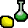

<!-------------------------------- Header -------------------------------->

  

 

<!-------------------------------- End of Header -------------------------------->

<!-------------------------------- Intro -------------------------------->

### Future data scientist in training - building one project at a time  

 &nbsp;&nbsp;&nbsp;Passionate about Data Science, Data Analysis, Data Engineering and Machine Learning  

 &nbsp;&nbsp;&nbsp;I enjoy solving real-world problems using data and turning insights into action  

 &nbsp;&nbsp;&nbsp;Naturally curious - I like to understand how things work  

 

<!-----------------skills-------------------->

  

 
<!-------------------------------- python -------------------------------->

   
  &nbsp&nbsp;&nbsp;  
  &nbsp&nbsp;&nbsp;  
  &nbsp;&nbsp&nbsp;&nbsp;  
   
  &nbsp&nbsp;&nbsp;  
  &nbsp&nbsp;&nbsp;  
  &nbsp&nbsp;&nbsp;  
       &nbsp&nbsp;&nbsp;             

<!-------------------------------- another languages -------------------------------->

 
  &nbsp&nbsp; 
     &nbsp&nbsp; 
   
 

<!-------------------------------- databses -------------------------------->

 
 
&nbsp&nbsp;&nbsp&nbsp; 

<!-------------------------------- cloud -------------------------------->

 
&nbsp&nbsp;&nbsp&nbsp;&nbsp&nbsp; 

 

<!-------------------------------- devtools -------------------------------->

 
&nbsp;&nbsp;&nbsp; &nbsp; 
  

 

 
<!-----------------contact-------------------->

  &nbsp; 
  

   &nbsp;&nbsp; &nbsp; 
   
   

 

 
<!-----------------contact-------------------->

  &nbsp; 
  
  &nbsp; &nbsp; 

